# doc-evergreen Command Flows

## Create Command Flow

The create command follows a 4-step process that generates high-quality, customized documentation:

1. **File Sourcing** - Gather source files based on patterns
2. **File Summarization** - Generate and cache LLM summaries of each file
3. **Template Customization** - Create tailored template based on summaries
4. **Document Generation** - Generate final documentation using customized template

### Prompt Management

All LLM prompts are stored as external files in `doc_evergreen/prompts/` for easy editing:
- `summarize_file.txt` - File summarization prompt (Step 2)
- `create_customized_template.txt` - Template customization prompt (Step 3)
- `generate_document.txt` - Document generation prompt (Step 4)
- `customize_template.txt` - Legacy template customization (not currently used)

```mermaid
flowchart TD
    Start([User runs create command<br/>Inputs: --about, --output, --sources]) --> Validate{Validate parameters}
    Validate -->|Missing required| Error1[Error: Missing --about or --output]
    Validate -->|Valid| FindRoot[Find git repository root<br/>Input: current working directory]

    FindRoot --> CheckCwd{Current directory<br/>is git root?}
    CheckCwd -->|No| Warn[Warn user + confirm]
    CheckCwd -->|Yes| Step1
    Warn --> Step1

    Step1[STEP 1: File Sourcing<br/>Gather files matching patterns<br/>Input: --sources patterns<br/>Supports: exact files + globs]

    Step1 --> CheckSources{Sources specified?}
    CheckSources -->|No| Error2[Error: --sources required<br/>Auto-discovery coming later]
    CheckSources -->|Yes| GatherFiles[Gather files using glob patterns<br/>Filter out output file<br/>Show count and total size]

    GatherFiles --> Step2[STEP 2: File Summarization<br/>Loop through each source file]

    Step2 --> CheckCache{Summary cached?<br/>Check .doc-evergreen/<br/>summaries.yaml}
    CheckCache -->|Yes| UseCache[Use cached summary<br/>Show timestamp]
    CheckCache -->|No| LoadPrompt1[Load prompt:<br/>prompts/summarize_file.txt]
    LoadPrompt1 --> GenSummary[Generate LLM summary<br/>2-3 sentence analysis<br/>Cache with timestamp]

    UseCache --> NextFile{More files?}
    GenSummary --> NextFile
    NextFile -->|Yes| Step2
    NextFile -->|No| Step3

    Step3[STEP 3: Template Customization<br/>Load readme template guide<br/>Input: guide + summaries + about]

    Step3 --> LoadPrompt2[Load prompt:<br/>prompts/create_customized_template.txt]
    LoadPrompt2 --> CustomizeLLM[LLM creates customized template<br/>• Defines sections<br/>• Maps files to sections<br/>• Explains file inclusion reasons]

    CustomizeLLM --> SaveCustom[Save to project directory:<br/>• template.md<br/>• template_index.yaml]

    SaveCustom --> Step4[STEP 4: Document Generation<br/>Generate using customized template<br/>Input: template + about]

    Step4 --> LoadPrompt3[Load prompt:<br/>prompts/generate_document.txt]
    LoadPrompt3 --> GenerateDoc[LLM generates final documentation]

    GenerateDoc --> CheckExisting{Output file exists?}
    CheckExisting -->|Yes| Backup[Backup to<br/>.doc-evergreen/versions/]
    CheckExisting -->|No| SaveAll
    Backup --> SaveAll

    SaveAll[Save to multiple locations:<br/>1. Specified output path<br/>2. Project directory content.md<br/>3. Project directory metadata.yaml]

    SaveAll --> UpdateHistory[Update history.yaml<br/>Inputs: sources, template, timestamp]

    UpdateHistory --> Success[✓ Document created successfully<br/>Show: output path, template type,<br/>source count, files referenced]
    Success --> End([End])
    Error1 --> End
    Error2 --> End
```



### Prompt Loading Architecture

The diagram shows three prompt loading steps:
- **LoadPrompt1** (Step 2): Loads `summarize_file.txt` for each file summary
- **LoadPrompt2** (Step 3): Loads `create_customized_template.txt` for template customization
- **LoadPrompt3** (Step 4): Loads `generate_document.txt` for final document generation

All prompts use Python's `.format()` for variable substitution and are loaded at runtime from `doc_evergreen/prompts/`.

## Regenerate Command Flow

**Note:** Regenerate command implementation is pending. It will follow the same 4-step flow as create but will:
- Load saved configuration from history.yaml
- Use cached summaries when available
- Load existing customized template from project directory
- Generate updated documentation

```mermaid
flowchart TD
    Start([User runs regenerate command<br/>Inputs: doc path or --all]) --> ValidateArgs{Validate arguments}

    ValidateArgs -->|No doc path<br/>and no --all| Error1[Error: Must specify<br/>doc path or --all]
    ValidateArgs -->|Both specified| Error2[Error: Cannot specify<br/>both doc path and --all]
    ValidateArgs -->|Valid| FindRoot[Find git repository root]

    FindRoot --> LoadHistory[Load .doc-evergreen/history.yaml]

    LoadHistory --> CheckHistory{History exists?}
    CheckHistory -->|No| Error3[Error: No history found<br/>Run create command first]
    CheckHistory -->|Yes| Mode{Regenerate mode?}

    Mode -->|Single doc| GetSingleConfig[Get config for document<br/>from history]
    Mode -->|All docs| GetAllConfigs[Get configs for all docs<br/>from history]

    GetSingleConfig --> CheckConfig{Config exists?}
    CheckConfig -->|No| Error4[Error: Document not in history]
    CheckConfig -->|Yes| ProcessSingle[Process single document]

    GetAllConfigs --> CheckEmpty{Any docs in history?}
    CheckEmpty -->|No| Error5[Error: No documents to regenerate]
    CheckEmpty -->|Yes| ProcessAll[Process each document]

    ProcessSingle --> RegenerateDoc
    ProcessAll --> RegenerateDoc

    RegenerateDoc[For each document:<br/>Load config from history]
    RegenerateDoc --> LoadConfig[Load saved config:<br/>• Source patterns<br/>• Template name<br/>• About description]

    LoadConfig --> Step1[STEP 1: File Sourcing<br/>Gather files matching<br/>saved patterns]

    Step1 --> Step2[STEP 2: File Summarization<br/>Use cached summaries<br/>Generate only for new/changed files]

    Step2 --> LoadTemplate[Load customized template<br/>from project directory:<br/>.doc-evergreen/projects/<br/>{doc_name}/template.md]

    LoadTemplate --> Step4[STEP 4: Document Generation<br/>Skip Step 3 - use existing<br/>customized template]

    Step4 --> Generate[Generate updated documentation]

    Generate --> Backup[Backup existing document<br/>to .doc-evergreen/versions/]

    Backup --> Save[Save to multiple locations:<br/>1. Output path<br/>2. Project directory]

    Save --> AddVersion[Add version entry to history<br/>Record: timestamp, backup path,<br/>template, sources]

    AddVersion --> Success[✓ Document regenerated]

    Success --> CheckMore{More docs to process?}
    CheckMore -->|Yes| RegenerateDoc
    CheckMore -->|No| End([End])

    Error1 --> End
    Error2 --> End
    Error3 --> End
    Error4 --> End
    Error5 --> End
```

## Template Customization Decision Tree


## Customization Scenarios Summary

### Scenario 1: Template Specified → Use Directly
```bash
doc-evergreen create \
    --about "API documentation" \
    --output docs/API.md \
    --template api-reference
# Result: Uses api-reference template as-is
```

### Scenario 2: Template Specified + Force Customize
```bash
doc-evergreen create \
    --about "API documentation" \
    --output docs/API.md \
    --template api-reference \
    --customize-template
# Result: Customizes api-reference based on source code
```

### Scenario 3: LLM-Selected → LLM Decides Not Needed
```bash
doc-evergreen create \
    --about "Simple README" \
    --output README.md
# LLM selects: readme template
# LLM evaluates: "NO: Template structure sufficient"
# Result: Uses readme template as-is
```

### Scenario 4: LLM-Selected → LLM Decides Customization Needed
```bash
doc-evergreen create \
    --about "CLI tool documentation" \
    --output README.md
# LLM selects: readme template
# LLM evaluates: "YES: CLI command structure needs dedicated section"
# Result: Customizes readme template to add CLI commands section
```

## File Structure After Operations

```
.doc-evergreen/
├── history.yaml              # All document configurations and versions
├── templates/
│   ├── readme-custom.v1.md  # Customized templates (if created)
│   └── api-reference-custom.v1.md
└── versions/
    ├── README.md.2025-01-07T10-30-00.bak
    └── docs/API.md.2025-01-07T11-15-00.bak
```

## Key Decision Points

### Source Discovery
- **With `--sources`**: Use exact files + glob patterns
- **Without `--sources`**: LLM-guided breadth-first discovery

### Template Selection
- **With `--template`**: Use specified template
- **Without `--template`**: LLM selects based on `--about`

### Template Customization
- **`--customize-template`**: Always customize
- **`--no-customize-template`**: Never customize
- **No flag + template specified**: Use directly
- **No flag + LLM-selected**: Ask LLM if beneficial
