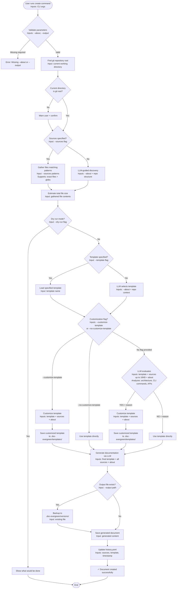
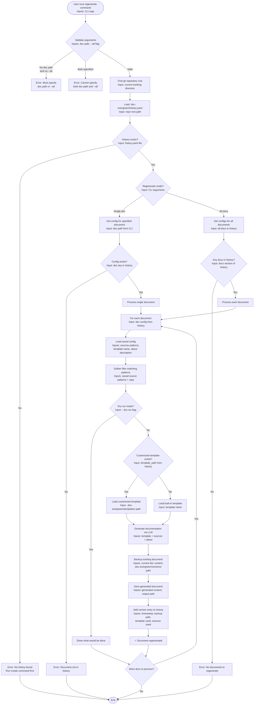
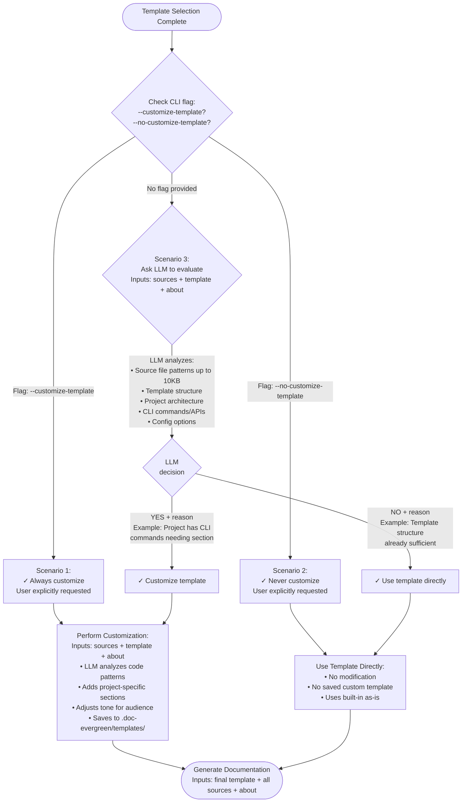

# doc-evergreen Command Flows

## Create Command Flow



## Regenerate Command Flow



## Template Customization Decision Tree



## Customization Scenarios Summary

### Scenario 1: Template Specified → Use Directly
```bash
doc-evergreen create \
    --about "API documentation" \
    --output docs/API.md \
    --template api-reference
# Result: Uses api-reference template as-is
```

### Scenario 2: Template Specified + Force Customize
```bash
doc-evergreen create \
    --about "API documentation" \
    --output docs/API.md \
    --template api-reference \
    --customize-template
# Result: Customizes api-reference based on source code
```

### Scenario 3: LLM-Selected → LLM Decides Not Needed
```bash
doc-evergreen create \
    --about "Simple README" \
    --output README.md
# LLM selects: readme template
# LLM evaluates: "NO: Template structure sufficient"
# Result: Uses readme template as-is
```

### Scenario 4: LLM-Selected → LLM Decides Customization Needed
```bash
doc-evergreen create \
    --about "CLI tool documentation" \
    --output README.md
# LLM selects: readme template
# LLM evaluates: "YES: CLI command structure needs dedicated section"
# Result: Customizes readme template to add CLI commands section
```

## File Structure After Operations

```
.doc-evergreen/
├── history.yaml              # All document configurations and versions
├── templates/
│   ├── readme-custom.v1.md  # Customized templates (if created)
│   └── api-reference-custom.v1.md
└── versions/
    ├── README.md.2025-01-07T10-30-00.bak
    └── docs/API.md.2025-01-07T11-15-00.bak
```

## Key Decision Points

### Source Discovery
- **With `--sources`**: Use exact files + glob patterns
- **Without `--sources`**: LLM-guided breadth-first discovery

### Template Selection
- **With `--template`**: Use specified template
- **Without `--template`**: LLM selects based on `--about`

### Template Customization
- **`--customize-template`**: Always customize
- **`--no-customize-template`**: Never customize
- **No flag + template specified**: Use directly
- **No flag + LLM-selected**: Ask LLM if beneficial
